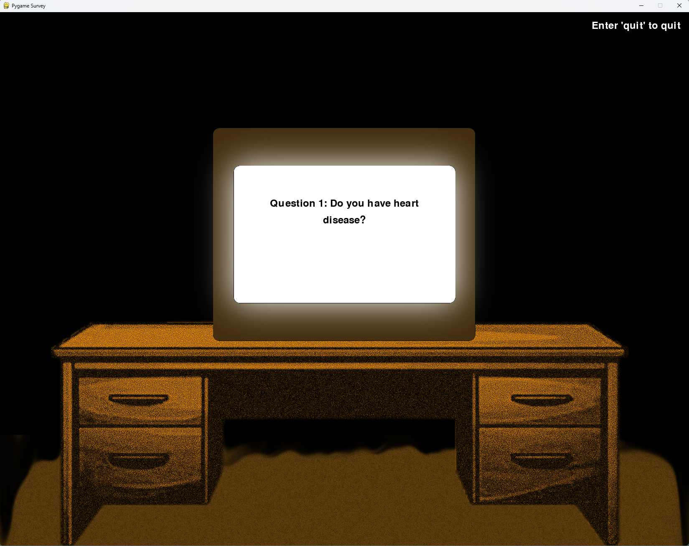

# Tate's Test

## Project Description
---
This phenominal horror game experience lets you take a survey with spooky twists along the way. It is designed to give the user
an adrenaline surge and creep them out.

## Installation
---
Not used for this class  

## Execution and usage
---
To use this project, all you have to do is read what is on screen and figure it out along the way. You can look around the game by using the arrow keys
and you can answer the questions by just typing them.
  

## Used techonologies
---
+ pygame
pip install pygame
+ opencv-python
pip install opencv-python

## Current Features
---
+ The first feature I am proud is the jumpscares, because they are very funny and the users love them.
+ The second feature I am proud of is the sounds, because they really make the experience more enjoyable.
+ The third feature I am proud of is the questions because that is the whole point of the game, which is a survery.

## Contributions
---
Not used for this class

## Contributors
---
+ ChatGPT, helped with library research for pygame.
+ Tate, was the model for the jumpscares
+ pygame.org, helped understand the pygame library.

## Author's Information
---
+ Connor Pavicic - I am a 9th grade programmer who is trying to get by. Coding is really fun for me unless it is an assignment since I like coding when it is chill and relaxed and you can code at your own pace. Here are the places you can find me at: [GitHub]: (https://github.com/ConnorP4231) or email: connor.pavicic@ucas-edu.net
+ Evan McCabe - I am programming for a 9th grade programming class. Coding's pretty fun sometimes, but I didn't really like this class, and I'm more interested in art and animation, so I don't know if I'll be coding much in the future. I'm pretty awesome though, so feel free to contact me!
GitHub: https://github.com/PurpleDG Email: purpledefies@gmail.com
+ Pedro Souza - 
+ Locklin Sheldon - 

## Change Log
---
Not used for this class

## License
---
Not used for this class